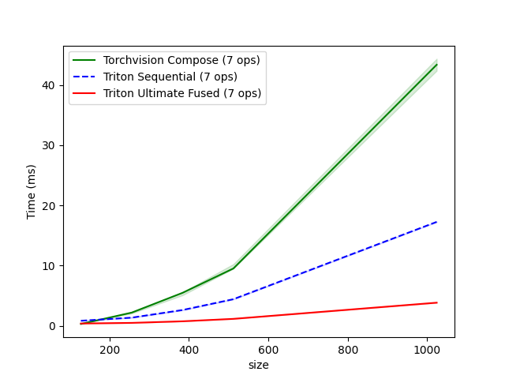

# Triton-Augment

**GPU-Accelerated Image Augmentation with Kernel Fusion**

[](https://www.python.org/downloads/)
[](https://pytorch.org/)
[](LICENSE)

Triton-Augment is a high-performance image augmentation library that leverages [OpenAI Triton](https://github.com/openai/triton) to fuse common transform operations, providing significant speedups over standard PyTorch implementations.

## ⚡ **5 - 12x Faster** than Torchvision on typical image augmentation

Replace your augmentation pipeline with a **single fused kernel** and get:
- **8.1x average speedup** on Tesla T4 (Google Colab free tier)
- **Up to 12x faster** on large images (1280×1280)
- **5D video tensor support** with `same_on_batch=False, same_on_frame=True` control; speedup: **8.6x vs Torchvision, 73.7x vs Kornia**

[📊 See full benchmarks →](#-performance)

**Key Idea**: Fuse multiple GPU operations into a single kernel → eliminate intermediate memory transfers → faster augmentation.

```python
# Traditional (torchvision Compose): 7 kernel launches
crop → flip → brightness → contrast → saturation → grayscale → normalize

# Triton-Augment Ultimate Fusion: 1 kernel launch 🚀
[crop + flip + brightness + contrast + saturation + grayscale + normalize]
```

---

## 🚀 Features

- **One Kernel, All Operations**: Fuse crop, flip, color jitter, grayscale, and normalize in a single kernel - significantly faster, scales with image size! 🚀
- **Different Parameters Per Sample**: Each image in batch gets different random augmentations (not just batch-wide) using `same_on_batch` argument
- **5D Video Tensor Support**: Native support for `[N, T, C, H, W]` video tensors with `same_on_frame` control for consistent augmentation across frames
- **Zero Memory Overhead**: No intermediate buffers between operations
- **Drop-in Replacement**: torchvision-like transforms & functional API, easy migration
- **Auto-Tuning**: Optional performance optimization for your GPU
- **Float16 Ready**: ~1.3x speedup on large images + 50% memory savings

---

## 📦 Quick Start

### Installation

```bash
pip install triton-augment
```

**Requirements**: Python 3.8+, PyTorch 2.0+, CUDA-capable GPU

**Try it now**: [](https://colab.research.google.com/drive/1aN0V3zjtINXZmj2gZPv9zwNiPrD48qcW) - Test correctness and run benchmarks without local setup

> **Note**: Colab is a shared service - performance may vary due to GPU allocation and resource contention. For stable benchmarking, use a dedicated GPU.

### Basic Usage

**Recommended: Ultimate Fusion** 🚀

```python
import torch
import triton_augment as ta

# Create batch of images on GPU
images = torch.rand(32, 3, 224, 224, device='cuda')

# Replace torchvision Compose (7 kernel launches)
# With Triton-Augment (1 kernel launch - significantly faster!)
transform = ta.TritonFusedAugment(
    crop_size=112,
    horizontal_flip_p=0.5,
    brightness=0.2,
    contrast=0.2,
    saturation=0.2,
    grayscale_p=0.1,
    mean=(0.485, 0.456, 0.406),
    std=(0.229, 0.224, 0.225)
)

augmented = transform(images)  # 🚀 Single kernel for entire pipeline!
```

**Video (5D) Support**: Native support for video tensors `[N, T, C, H, W]`:

```python
# Video batch: 8 videos × 16 frames × 3 channels × 224×224
videos = torch.rand(8, 16, 3, 224, 224, device='cuda')

transform = ta.TritonFusedAugment(
    crop_size=112,
    horizontal_flip_p=0.5,
    brightness=0.2, contrast=0.2, saturation=0.2,
    same_on_frame=True,  # Same augmentation for all frames (default)
    mean=(0.485, 0.456, 0.406), std=(0.229, 0.224, 0.225)
)

augmented = transform(videos)  # Shape: [8, 16, 3, 112, 112]
```

**Need only some operations?** Set unused parameters to their default values:

```python
# Example: Only saturation adjustment + horizontal flip
transform = ta.TritonFusedAugment(
    crop_size=224,          # No crop (same size as input)
    saturation=0.2,         # Only saturation jitter
    horizontal_flip_p=0.5,  # Only random flip
)
```

**Specialized APIs**: For convenience, also available: `TritonColorJitterNormalize`, `TritonRandomCropFlip`, etc.

### 🔗 Combine with Torchvision Transforms

For operations not yet supported by Triton-Augment (like rotation, perspective transforms, etc.), combine with torchvision transforms:

```python
import torchvision.transforms.v2 as transforms

# Triton-Augment + Torchvision (per-image randomness + unsupported ops)
transform = transforms.Compose([
    transforms.RandomRotation(degrees=15),  # Torchvision (no per-image randomness)
    ta.TritonColorJitterNormalize(         # Triton-Augment (per-image randomness)
        brightness=0.2, contrast=0.2, saturation=0.2,
        mean=(0.485, 0.456, 0.406), std=(0.229, 0.224, 0.225)
    )
])
```

**Note**: Torchvision transforms.v2 apply the same random parameters to all images in a batch, while Triton-Augment provides true per-image randomness. [Kornia](https://kornia.readthedocs.io/) also supports per-image randomness, but is slower in our benchmarks.

[→ More Examples](https://yuhezhang-ai.github.io/triton-augment/quickstart/)

### ⚠️ Input Requirements

- **Range**: Images must be in `[0, 1]` range (e.g., use `torchvision.transforms.ToTensor()`)
- **Device**: GPU (CUDA) - *CPU tensors automatically moved to GPU*
- **Shape**: `(C, H, W)`, `(N, C, H, W)`, or `(N, T, C, H, W)` - *5D for video*
- **Dtype**: `float32` or `float16`

---

## 📚 Documentation

**Full documentation**: https://yuhezhang-ai.github.io/triton-augment (or see `docs/` folder)

| Guide | Description |
|-------|-------------|
| [Quick Start](docs/quickstart.md) | Get started in 5 minutes with examples |
| [Installation](docs/installation.md) | Setup and requirements |
| [API Reference](https://yuhezhang-ai.github.io/triton-augment/api-reference/) | Complete API documentation for all functions and classes |
| [Contrast Notes](docs/contrast.md) | Fused kernel uses fast contrast (different from torchvision). See how to get exact torchvision results |
| [Auto-Tuning](docs/auto-tuning.md) | Optional performance optimization for your GPU and data size (disabled by default). Includes cache warm-up guide |
| [Batch Behavior](docs/batch-behavior.md) | Different parameters per sample (default) vs batch-wide parameters. Understanding `same_on_batch` flag |
| [Float16 Support](docs/float16.md) | Use half-precision for ~1.3x speedup (large images) and 50% memory savings |
| [Comparison with Other Libraries](docs/comparison-other-libs.md) | How Triton-Augment compares to DALI, Kornia, and when to use each |

---

## ⚡ Performance

**📊 [Run benchmarks yourself on Google Colab](https://colab.research.google.com/drive/1aN0V3zjtINXZmj2gZPv9zwNiPrD48qcW)** - Verify correctness and performance on free GPU  
*Note: Colab performance may vary due to shared resources*

### Image Augmentation Benchmark Results

**Real training scenario with random augmentations on Tesla T4 (Google Colab Free Tier):**

| Image Size | Batch | Crop Size | Torchvision | Triton Fused | Speedup |
|------------|-------|-----------|-------------|--------------|---------|
| 256×256    | 32    | 224×224   | 2.48 ms     | 0.56 ms      | **4.5x** |
| 256×256    | 64    | 224×224   | 4.51 ms     | 0.69 ms      | **6.5x** |
| 600×600    | 32    | 512×512   | 11.82 ms    | 1.26 ms      | **9.4x** |
| 1280×1280  | 32    | 1024×1024 | 48.91 ms    | 4.07 ms      | **12.0x** |

**Average Speedup: 8.1x** 🚀

> **Operations**: RandomCrop + RandomHorizontalFlip + ColorJitter + RandomGrayscale + Normalize
> 
> **Note**: Benchmarks always use `torchvision.transforms.v2` (not the legacy v1 API) for comparison.

**Performance scales with image size** — larger images benefit more from kernel fusion:
<p align="left" style="margin: 0;">
  
</p>

<details>
<summary><b>📊 Additional Benchmarks (NVIDIA A100 on Google Colab)</b></summary>

| Image Size | Batch | Crop Size | Torchvision | Triton Fused | Speedup |
|------------|-------|-----------|-------------|--------------|---------|
| 256×256    | 32    | 224×224   | 0.61 ms     | 0.44 ms      | **1.4x** |
| 256×256    | 64    | 224×224   | 0.93 ms     | 0.43 ms      | **2.1x** |
| 600×600    | 32    | 512×512   | 2.19 ms     | 0.50 ms      | **4.4x** |
| 1280×1280  | 32    | 1024×1024 | 8.23 ms     | 0.94 ms      | **8.7x** |

**Average: 4.1x**

> **Why better speedup on T4?** Kernel fusion reduces memory bandwidth bottlenecks, which matters more on bandwidth-limited GPUs like T4 (320 GB/s) vs A100 (1,555 GB/s). This means **greater benefits on consumer and mid-range hardware**.

</details>

### Video (5D Tensor) Benchmarks

**Video augmentation on Tesla T4 (Google Colab Free Tier) - Input shape `[N, T, C, H, W]`:**

| Batch | Frames | Image Size | Crop Size | Torchvision | Kornia VideoSeq | Triton Fused | Speedup vs TV | Speedup vs Kornia |
|-------|--------|------------|-----------|-------------|-----------------|--------------|---------------|-------------------|
|     8 |     16 | 256×256    | 224×224   | 8.86 ms     | 78.20 ms        | 1.21 ms      | **7.3x**      | **64.6x**         |
|     4 |     32 | 256×256    | 224×224   | 8.84 ms     | 78.39 ms        | 1.08 ms      | **8.2x**      | **72.6x**         |
|    16 |      8 | 256×256    | 224×224   | 9.06 ms     | 78.69 ms        | 1.07 ms      | **8.5x**      | **73.5x**         |
|     8 |     16 | 512×512    | 448×448   | 33.75 ms    | 272.59 ms       | 3.24 ms      | **10.4x**     | **84.1x**         |

**Average Speedup vs Torchvision: 8.6x**  
**Average Speedup vs Kornia: 73.7x** 🚀

<details>
<summary><h3>Run Your Own Benchmarks</h3></summary>

**Quick Benchmark** (Ultimate Fusion only):
```bash
# Simple, clean table output - easy to run!
python examples/benchmark.py
python examples/benchmark_video.py
```

**Detailed Benchmark** (All operations):
```bash
# Comprehensive analysis with visualizations
python examples/benchmark_triton.py
```

</details>

---

## 💡 Auto-Tuning

All benchmark results shown above use default kernel configurations. Auto-tuning can potentially provide **additional speedup** on dedicated GPUs.

**What is Auto-Tuning?**

Triton kernels have tunable parameters (block sizes, warps per thread, etc.) that affect performance. Auto-tuning automatically searches for the optimal configuration for **your specific GPU and data sizes**.

**When to use:**
- ✅ **Dedicated GPUs** (local workstations, cloud instances): 10-30% additional speedup
- ⚠️ **Shared services** (Colab, Kaggle): Limited benefits, but can help stabilize performance

**Quick start:**
```python
import triton_augment as ta

ta.set_autotune(True)  # Enable auto-tuning (one-time cost, results cached)
transform = ta.TritonFusedAugment(...)
augmented = transform(images)  # First run: tests configs; subsequent: uses cache
```

**⚠️ Performance Variability**: Our highly optimized kernels are more sensitive to resource contention. If you experience **sudden latency spikes** on shared services, this is expected due to competing workloads. Auto-tuning can help find more stable configurations.

📖 **Full guide**: [Auto-Tuning Guide](docs/auto-tuning.md) - Detailed instructions, cache management, and warm-up strategies

---

## 🎯 When to Use Triton-Augment?

**💡 Use Triton-Augment + Torchvision together:**
- **Torchvision**: Data loading, resize, ToTensor, rotation, affine, etc.
- **Triton-Augment**: Replace supported operations (currently: crop, flip, color jitter, grayscale, normalize; more coming) with fused GPU kernels

**Best speedup when:**
- Large images (500x500+) or large batches
- Data augmentations are your bottleneck

**Stick with Torchvision only if:**
- CPU-only training
- Experiencing **extreme latency variability** on **shared services** (e.g., consistent 10x+ spikes) - our optimized kernels are more sensitive to resource contention. Try auto-tuning first; if instability persists, Torchvision may be more stable

💡 **TL;DR**: Use both! Triton-Augment replaces Torchvision's fusible ops for 8-12x speedup.

---

<details>
<summary><h2>🎓 Training Examples</h2></summary>

Clean, focused examples showing Triton-Augment integration in real training pipelines:

```bash
# MNIST training example (grayscale images, simple)
python examples/train_mnist.py

# CIFAR-10 training example (RGB images, recommended)
python examples/train_cifar10.py
```

**Key Integration Points:**

| Operation | Use | Why |
|-----------|-----|-----|
| Data Loading | torchvision.datasets | Standard data loading |
| Resize | torchvision.transforms | Not covered by Triton-Augment |
| ToTensor | torchvision.transforms | PIL Image → Tensor conversion |
| Crop, Flip, ColorJitter, Normalize | Triton-Augment | GPU-accelerated, fusible |

**Example Integration:**

```python
import torch
import triton_augment as ta
from torchvision import datasets, transforms
from torch.utils.data import DataLoader

# Step 1: Data loading on CPU with workers (fast async I/O!)
train_dataset = datasets.CIFAR10(
    './data', train=True,
    transform=transforms.ToTensor()  # Only ToTensor on CPU
)

train_loader = DataLoader(
    train_dataset, 
    batch_size=128,
    num_workers=4,  # ✅ Use workers for fast async loading!
    pin_memory=True
)

# Step 2: Create GPU augmentation transform (define once, reuse)
augment = ta.TritonFusedAugment(
    crop_size=28,
    horizontal_flip_p=0.5,
    brightness=0.2, contrast=0.2, saturation=0.2,
    mean=(0.4914, 0.4822, 0.4465),
    std=(0.2470, 0.2435, 0.2616),
    same_on_batch=False  # Each image gets different random params (default)
)

# Step 3: Apply in training loop on GPU batches
for images, labels in train_loader:
    images, labels = images.cuda(), labels.cuda()
    images = augment(images)  # All ops in 1 kernel per batch! 🚀
    
    outputs = model(images)
    # ... rest of training ...
```

**Why This Pattern:**

- ✅ **Fast async data loading**: `num_workers > 0` for CPU parallelism
- ✅ **Fast GPU batch processing**: All augmentations in 1 fused kernel
- ✅ **Different parameters per sample**: Each image gets different random parameters (default)
- ✅ **Best of both worlds**: CPU for I/O, GPU for compute
- ✅ **Kernel fusion**: No intermediate memory allocations
- ✅ **Large batch advantage**: Speedup increases with batch size

**Note**: Set `same_on_batch=True` if you want all images to share the same random parameters.

💡 **Pro Tip**: Apply Triton-Augment transforms AFTER moving tensors to GPU for maximum performance!

</details>

---

<details>
<summary><h2>🛠️ API Overview</h2></summary>

### Transform Classes (Recommended)

**Multi-operation transforms use the fused kernel** (single kernel for best performance):

```python
import triton_augment as ta

# Ultimate API - full control, all operations (uses fused kernel)
ultimate = ta.TritonFusedAugment(
    crop_size=112, horizontal_flip_p=0.5,
    brightness=0.2, contrast=0.2, saturation=0.2,
    mean=(0.485, 0.456, 0.406), std=(0.229, 0.224, 0.225)
)

# Specialized APIs - convenience wrappers (also use fused kernel)
color_only = ta.TritonColorJitterNormalize(
    brightness=0.2, saturation=0.2,
    mean=(0.485, 0.456, 0.406), std=(0.229, 0.224, 0.225)
)
geo_only = ta.TritonRandomCropFlip(size=112, horizontal_flip_p=0.5)

# Individual transforms (use separate kernels, for maximum control)
crop = ta.TritonRandomCrop(112)
flip = ta.TritonRandomHorizontalFlip(p=0.5)
jitter = ta.TritonColorJitter(brightness=0.2)
```

### Functional API (Low-level)

```python
import triton_augment.functional as F

# Ultimate fusion - ALL operations (single kernel)
result = F.fused_augment(
    img, top=20, left=30, height=112, width=112,
    flip_horizontal=True, brightness_factor=1.2,
    saturation_factor=0.9, mean=(...), std=(...)
)

# Individual operations (separate kernels)
cropped = F.crop(img, top=20, left=30, height=112, width=112)
flipped = F.horizontal_flip(img)
img = F.adjust_brightness(img, 1.2)
img = F.adjust_saturation(img, 0.9)
img = F.normalize(img, mean=(...), std=(...))
```

[→ Complete API Reference](docs/api-reference.md)

</details>

---

## 📋 Roadmap

- [x] **Phase 1**: Fused color operations (brightness, contrast, saturation, normalize)
- [x] **Phase 1.5**: Grayscale, float16 support, auto-tuning
- [x] **Phase 2**: Basic Geometric operations (crop, flip) + Ultimate fusion 🚀
- [x] **Phase 2.5**: 5D video tensor support `[N, T, C, H, W]` with `same_on_frame` parameter
- [ ] **Phase 3**: Extended operations (resize, rotation, blur, erasing, mixup, etc.)
- [ ] **Future**: Differentiable augmentation (autograd support, available in Kornia) - evaluate demand vs performance tradeoff

---

## 🤝 Contributing

Contributions welcome! Please see [CONTRIBUTING.md](CONTRIBUTING.md) for guidelines.

```bash
# Development setup
pip install -e ".[dev]"

# Useful commands
make help        # Show all available commands
make test        # Run tests
```

---

## 📝 License

Apache License 2.0 - see [LICENSE](LICENSE) file.

---

## 🙏 Acknowledgments

- [OpenAI Triton](https://github.com/openai/triton) - GPU programming framework
- [PyTorch](https://pytorch.org/) - Deep learning foundation
- [torchvision](https://github.com/pytorch/vision) - API inspiration

---

## 👤 Author

**Yuhe Zhang**

- 💼 LinkedIn: [Yuhe Zhang](https://www.linkedin.com/in/yuhe-zhang-phd/)
- 📧 Email: yuhezhang.zju @ gmail.com

*Research interests: Applied ML, Computer Vision, Efficient Deep Learning, GPU Acceleration*

---

<div align="center">

Feel free to file issues or feature requests: [GitHub Issues](https://github.com/yuhezhang-ai/triton-augment/issues)


⭐ **If you find this library useful, please consider starring the repo!** ⭐

[Documentation](https://yuhezhang-ai.github.io/triton-augment) • [GitHub](https://github.com/yuhezhang-ai/triton-augment) • [PyPI](https://pypi.org/project/triton-augment/)

</div>
