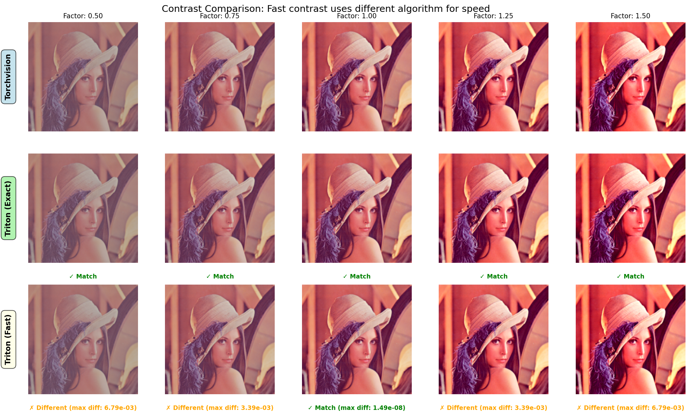

# Contrast Implementation

!!! warning "Important"
    This library implements a **different contrast algorithm** than torchvision for speed and fusion benefits.

## TL;DR

- `F.fused_augment()` and transforms class like `TritonColorJitter`, `TritonFusedAugment` uses **fast contrast** (not torchvision-exact)
- For exact torchvision results, use individual functional `F.adjust_contrast()`
- Fast contrast is production-proven (same as NVIDIA DALI)

## Technical Details

### Torchvision Contrast

```python
grayscale_mean = mean(rgb_to_grayscale(input))
output = input * contrast_factor + grayscale_mean * (1 - contrast_factor)
```

**Problem for fusion**: Requires computing the mean of the entire image, which:

- Needs an extra kernel launch

- Breaks the fusion (can't fuse before knowing the mean)

- Creates a data dependency

### Fast Contrast

```python
output = (input - 0.5) * contrast_factor + 0.5
```

**Benefits**:

- No mean computation needed

- Fully fusible with other operations

- Single kernel launch for entire pipeline

- 0.5 is a reasonable default anchor point (middle of [0, 1] range)

### Impact on Training

In practice, the difference is minimal:

- Models learn to be robust to data augmentation variations

- The specific contrast formula matters less than having contrast augmentation at all

- NVIDIA DALI uses this approach in production ML systems worldwide

## Visual Comparison



*Visual comparison between torchvision (top), triton-exact (middle) and triton-fast (bottom) at various contrast factors. This figure is generated by `python examples/visualize_augmentations.py`.*

!!! note "Minimal Visual Differences"
    The differences between fast and exact contrast in this sample image are **very small** and barely perceptible to the human eye. For brighter or darker images, the differences might be more noticeable, but the impact on model training is minimal.

## Contrast Formula: Comparison to Other Libraries

| Library | Formula | Type | Speed |
|---------|---------|------|-------|
| **NVIDIA DALI** | `(x - 0.5) * f + 0.5` | Linear (centered) | Fastest ✅ |
| **Triton-Augment (fast)** | `(x - 0.5) * f + 0.5` | Linear (centered) | Fastest ✅ |
| **OpenCV** | `alpha * x + beta` | Linear | Fast |
| **Torchvision** | `x * f + mean * (1-f)` | Linear (mean) | Slower |
| **Scikit-image** | `1/(1+exp(-gain*(x-cut)))` | Sigmoid (S-curve) | Slowest |

## Why This Formula?

✅ **Production-proven**: Same as NVIDIA DALI  
✅ **Fast & fusible**: No mean computation required  

If you need **exact torchvision reproduction**, use `F.adjust_contrast()` instead of fast mode. See the following ways to produce exact torchvision results.

## Three Equivalent Ways (Torchvision-Exact)

All three approaches below produce **pixel-perfect identical results**:

### 1. Torchvision

```python
import torchvision.transforms.v2.functional as tvF

img = torch.rand(1, 3, 224, 224, device='cuda')
result = tvF.adjust_brightness(img, 1.2)
result = tvF.adjust_contrast(result, 1.1)
result = tvF.adjust_saturation(result, 0.9)
result = tvF.normalize(result, mean=[0.485, 0.456, 0.406], std=[0.229, 0.224, 0.225])

```

⏱️ **Speed**: Baseline

### 2. Triton Individual Functions (Exact)

```python
import triton_augment.functional as F

img = torch.rand(1, 3, 224, 224, device='cuda')
result = F.adjust_brightness(img, 1.2)
result = F.adjust_contrast(result, 1.1)        # Torchvision-exact
result = F.adjust_saturation(result, 0.9)
result = F.normalize(result, 
                     mean=(0.485, 0.456, 0.406),
                     std=(0.229, 0.224, 0.225))
```

⏱️ **Speed**: Faster (optimized Triton kernels) ⚡

### 3. Triton Contrast + Fused (Exact + Fast)

```python
import triton_augment.functional as F

img = torch.rand(1, 3, 224, 224, device='cuda')
# Apply exact contrast first
result = F.adjust_brightness(img, 1.2)
result = F.adjust_contrast(result, 1.1)        # Torchvision-exact

# Then fuse remaining ops (no contrast)
result = F.fused_augment(
    result,
    brightness_factor=1.0,                     # Identity (already applied)
    contrast_factor=1.0,                       # Identity (already applied)
    saturation_factor=0.9,
    mean=(0.485, 0.456, 0.406),
    std=(0.229, 0.224, 0.225)
)
```

⏱️ **Speed**: Fast (3 kernel launches) ⚡⚡

## For Maximum Speed (Not Exact)

If you don't need exact torchvision reproduction:

```python
import triton_augment.functional as F

# Single fused kernel - fastest!
result = F.fused_augment(
    img,
    brightness_factor=1.2,
    contrast_factor=1.1,                       # Fast contrast (different from torchvision)
    saturation_factor=0.9,
    mean=(0.485, 0.456, 0.406),
    std=(0.229, 0.224, 0.225)
)
```

⏱️ **Speed**: Fastest (single fused kernel) 🚀
